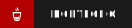

<h1> Hello there! :tanabata_tree::bamboo::cherry_blossom: </h1>

    
    
    
    
    
    
    
    

<b>Personas:</b> 
    🍜 <a href="https://github.com/CyberMantaRay">@CyberMantaRay</a>
    🤖 <a href="https://github.com/Ryo112358">@Ryo112358</a>
    🐸 <a href="https://github.com/OmnicWolf">@OmnicWolf</a> 🎮

<!--
**CoffeelessProgrammer/CoffeelessProgrammer** is a ✨ _special_ ✨ repository because its `README.md` (this file) appears on your GitHub profile.

Here are some ideas to get you started:

- 🔭 I’m currently working on ...
- 🌱 I’m currently learning ...
- 👯 I’m looking to collaborate on ...
- 🤔 I’m looking for help with ...
- 💬 Ask me about ...
- 📫 How to reach me: ...
- 😄 Pronouns: ...
- ⚡ Fun fact: ...
-->
